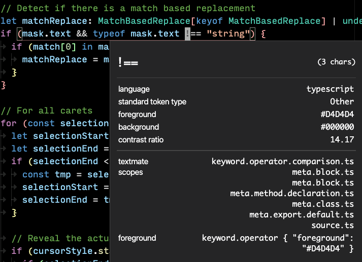

# Symbol Masks

Mask symbols in your code with custom styles and replacement text.


## Usage

Specify a pattern that will match a symbol to be masked in your settings.json file:

```json
"symbolMasks.masks": [
  {
    "language": "plaintext",
    "patterns": [
        {
            "pattern": "(?<=\\b)lambda(?=\\b)",
            "replace": "value": "λ",
            "style": {
              "fontWeight": "bold"
            }
        }
    ]
  }
]
```

### Mask Multiple Symbols At Once

For efficiency, you can also match many symbols at once and map each of them to an individual mask:

```json
"symbolMasks.masks": [
  {
    "language": "plaintext",
    "patterns": [
        {
            "pattern": "(?<=\\b)(lambda|omega)(?=\\b)",
            "replace": {
              "lambda": {
                  "value": "λ",
                  "fontWeight": "bold"
              },
              "omega": {
                  "value": "ω"
              }
            }
        }
    ]
  }
]
```

### Mask Based On TextMate Scope

Creating more intelligent masks is as simple as specifying a textmate scope the mask should look for. This can be done in both single and multiple masking mode:

```json
"symbolMasks.masks": [
  {
    "language": "typescript",
    "patterns": [
      {
        "pattern": "!==|!=",
        "replace": {
          "!=": {
            "scope": "keyword.operator.comparison",
            "text": "≉"
          },
          "!==": {
              "scope": "keyword.operator.comparison",
              "text": "≢"
          }
        }
      }
    ]
  }
]
```

The result:


Since the `!==` in the comment does not match the specified scope, it doesn't get masked.

To find find the scopes for a given symbol, simply run `Ctrl+Shift+P` and the command `Developer: Inspect Editor Tokens and Scopes`:


